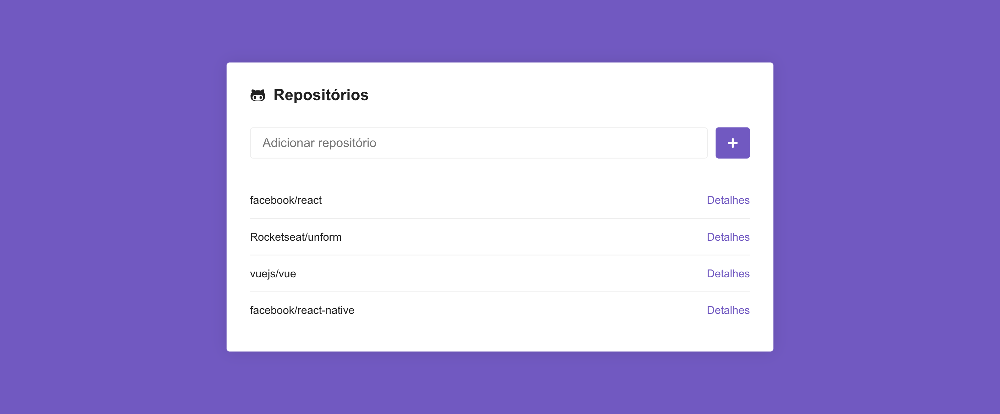
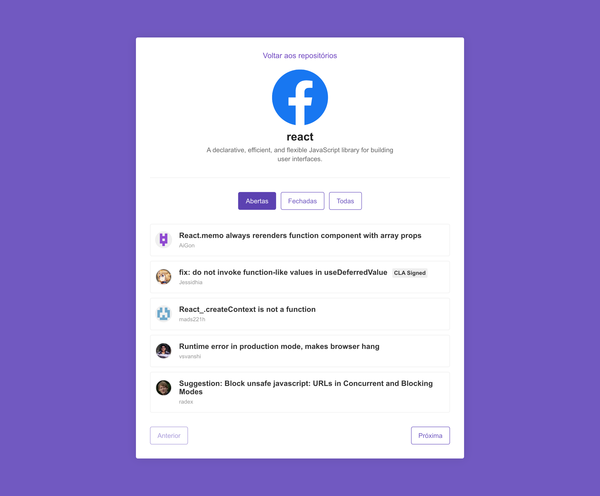

<h1 align="center">
  
</h1>

<h3 align="center">
  Desafio 5: Primeiro projeto com ReactJS
</h3>

## Sobre o desafio

Aplicação criada para o [Desafio 05](https://github.com/Rocketseat/bootcamp-gostack-desafio-05) do Bootcamp da Rocketseat.

### Funcionalidades

#### 1. Listagem de repositórios do Github

Repositórios são adicionados pelo `input` e colocados em uma lista com um botão de detalhes para ver mais informações.

#### 2. Issues do Repositório

Na página de descrição do repositório são mostradas mais informações junto com as issues e seus respectivos autores.

#### 3. Filtro de estado

Filtro de estado na listagem de Issues que criamos no detalhe do repositório. O estado representa se a issue está em aberto, fechada ou uma opção para exibir todas.

#### 4. Paginação

Paginação nas issues listadas no detalhe do repositório. O botão de página anterior fica desativado na primeira página e o de próxima página fica desativado na última página.

## Licença

Esse projeto está sob a licença MIT. Veja o arquivo [LICENSE](LICENSE) para mais detalhes.
